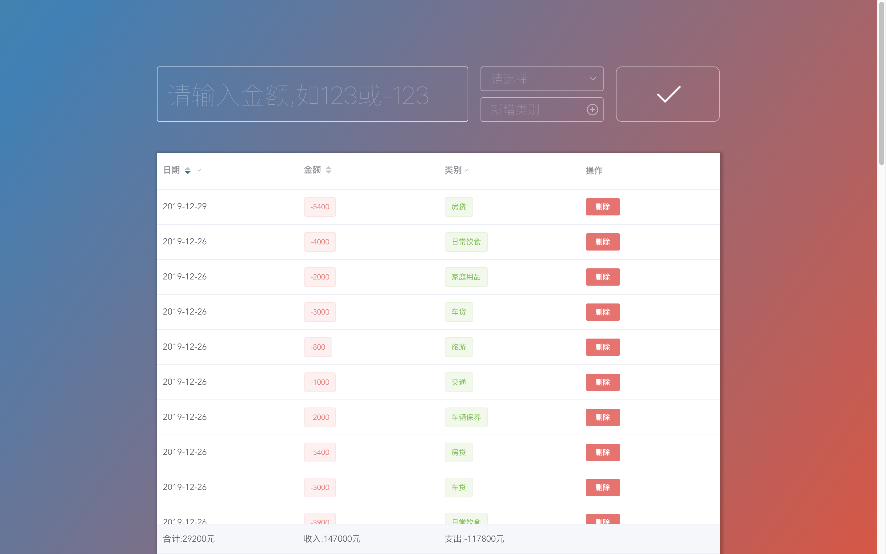

## 📚 项目简介

**本项目使用 Vue2.0+vuex+element.ui 进行搭建，实现简易的记账簿功能，并拥有简约的 ui 体验。**



## 🔧 如何使用

```
npm install
npm run serve
```

## 🔥 功能介绍

1. 加载 csv 数据
2. 以列表的形式展现账单内容 **（支持月份、分类二次筛选）**
3. 支持用户添加账单 精度为小数点后两位 **（支出请添加'-'如'-200'）**
4. 支持用户添加账单分类
5. 底部动态统计展示当前列表的 **合计、收入、支出金额**

## 🧠 技术思考

1. 如何引入 csv 文件

使用 npm csvtojson 库，在 `store/state.js` 中封装了一个 initCsv 函数
因为是异步读取导致一开始无法对拿到的数据正确进行处理（异步解析未完成）包装了一个 Promise 对象后成功解决。

```js
const request = require("request");
const csv = require("csvtojson");

function initCsv(filename) {
  let url = "http://localhost:8080/" + filename + ".csv";
  let initData = [];
  return new Promise(resolve => {
    csv()
      .fromStream(request.get(url))
      .subscribe(
        json => {
          initData.push(json);
        },
        () => {},
        () => resolve(initData)
      );
  });
}
```

2. 如何对动态渲染的账单数组进行准确删除

一开始想到的是在初始化数据时给每条数据对象加上 id 属性，并通过`Array.splice(id,1)`的方法删除对应数据，但是每次数据变化时 id 与数组下标便无法对应。

最终使用给每条数据同时加上 id 和 isDeleted 属性解决，**在删除后既不改变数组长度，也能通过 isDeleted 方便的筛选需要渲染的数据。**

3. 入账 0.33 元时显示 Bug

JS 采用 IEEE 754 双精度版本导致精度丢失
`(income = parseFloat((income + money).toFixed(10)))`解决

4. 统一简约的 UI

整体使用 element.UI

**新增账单框的 UI 是在 element 的基础上使用`scss`进行改写，保留相应逻辑的同时实现优美极简的用户体验。**

**支出的金额将以红色字体展示，收入以绿色展示**，方便区分。

收入支出合计栏以**吸底方式**呈现，让用户随时在任何位置都能看到当前账单的合计信息

5. 输入框校验

如不符合校验要求使用`vue-toasted`库进行消息提示

- 金额格式+精度校验（小数点后两位）

```js
//使用正则判断
checkInput() {
      // 检查输入格式是否符合最高精度两位小数的数字
      !/^(-)?(\d+\.?)?\d{0,2}$/.test(this.input.money)
        ? (this.showTip = true)
        : (this.showTip = false);
    }
```

- 新增账单完整性校验

```js
addBill() {
      if (!this.showTip) {
        if (this.input.money && this.input.cate) {
          //执行新增数据方法
        } else {
          this.$toasted.show("请输入完整账单数据", {
            theme: "outline",
            position: "top-right",
            duration: 2000
          });
        }
      } else {
        this.$toasted.show("金额格式错误", {
          theme: "outline",
          position: "top-right",
          duration: 2000
        });
        this.input.money = "";
        this.showTip = false;
      }
		}
```

6. 新增分类生成 id

统一 csv 格式 给用户添加的分类生成 10 位随机 id

```js
function randomString() {
  let chars = "abcdefhijkmnprstwxyz2345678";
  let res = "";
  for (let i = 0; i < 10; i++) {
    res += chars.charAt(Math.floor(Math.random() * chars.length));
  }
  return res;
}
obj.id = randomString();
```

7. 月份筛选功能实现

因为 elementUI 需要接收一个`[{text:'',value:''}]`格式的数组为我们提供筛选框的展示。

处理原始数据思路：

- 使用`date-format`库将时间戳转为`yyyy-MM`格式
- 对相同月份的数据进行去重
- 对去重完的数据进行冒泡排序**实现最近的月份在上 优化体验**

```js
monthFilter: (state, getters) => {
  // 1.初始一个数组 格式[{text:'',value:''}]
  let bill = getters.bill;
  let res = [];
  // 2.循环bill 推入包含的月份
  bill.forEach(item => {
    let obj = {};
    let date = new Date(Number(item.time));
    obj = {
      text: format.asString("yyyy-MM", date),
      value: Number(format.asString("yyyy", date) + format.asString("MM", date))
    };
    let flag = 0;
    // 去重
    for (let i = 0; i < res.length; i++) {
      if (JSON.stringify(res[i]) === JSON.stringify(obj)) {
        flag = 1;
      }
    }
    if (flag == 0) {
      res.push(obj);
    }
  });
  // 冒泡排序
  for (let i = 0; i < res.length - 1; i++) {
    for (let j = 0; j < res.length - i - 1; j++) {
      if (res[j]["value"] > res[j + 1]["value"]) {
        let temp = res[j];
        res[j] = res[j + 1];
        res[j + 1] = temp;
      }
    }
  }

  return res.reverse();
};
```

## ⚠️ 存在问题

1. 未进行移动端适配
2. 未实现收入支出条目的排序功能
3. 疑似背景动画占用 GPU 过多
4. 账单 UI 未优化
5. 未实现 pie chart 展示
